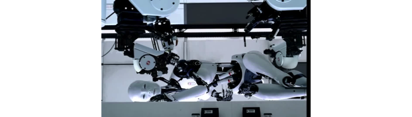

<!-- README.md is generated from README.Rmd. Please edit that file -->

# narampeg

<!-- badges: start -->


<!-- badges: end -->

`narampeg` is a video decoder which supports mpeg1 video and mp2 audio.
Realtime decoding+playback works (tested on a Mac M2).

# TODO before release

- Render a small snippet from ‘BigBuckBunny’ to include in package.

## Future

- Figure out way to playback gapless audio. I don’t think this is
  possible with the current `{audio}` package.
- Implement a more complete video playback package using the `ffmpeg`
  library. \*\* Happy to help somebody else do this if they’re
  interested \*\*

## Installation

You can install from
[GitHub](https://github.com/coolbutuseless/narampeg) with:

``` r
# install.packages('remotes')
remotes::install_github('coolbutuseless/narampeg')
```

## Example: Video playback at 25 fps

Video playback is achieved by decoding one-frame-at-a-time and rendering
to a fast graphics device.

The [`{governor}`](https://cran.r-project.org/package=governor) package
is used to limit the framerate to as close to 25fps as possible.

``` r
# install.packages('governor')
library(grid)
library(governor)
library(narampeg)

# Open a fast graphics device
x11(type = 'dbcairo', antialias = 'none', width = 7, height = 4)
dev.control(displaylist = 'inhibit')

# Initialise the playback
ctx <- narampeg::init_mpeg(file)
gov <- governor::gov_init(1/25)  # 25fps

# Loop: decode + render
while(TRUE) {
  nr <- mpeg_decode_video(ctx)
  if (is.null(nr)) break;
  dev.hold(); grid.raster(nr); dev.flush()
  gov_wait(gov)
}      
```

## Example: Rendering still images from a video

- Demo file (45 Mb)
  <https://phoboslab.org/files/bjork-all-is-full-of-love.mpg>

``` r
library(narampeg)

#~~~~~~~~~~~~~~~~~~~~~~~~~~~~~~~~~~~~~~~~~~~~~~~~~~~~~~~~~~~~~~~~~~~~~~~~~~~~
# Open a video file
#~~~~~~~~~~~~~~~~~~~~~~~~~~~~~~~~~~~~~~~~~~~~~~~~~~~~~~~~~~~~~~~~~~~~~~~~~~~~
file <- "~/projectsdata/mpeg/bjork-all-is-full-of-love.mpg"
ctx <- init_mpeg(file)
mpeg_info(ctx) |> unlist()
#>         width        height video_streams audio_streams           fps 
#>           960           540             1             1            25 
#>   sample_rate interval_time      duration 
#>         44100             0           248

#~~~~~~~~~~~~~~~~~~~~~~~~~~~~~~~~~~~~~~~~~~~~~~~~~~~~~~~~~~~~~~~~~~~~~~~~~~~~
# Render 4 images from various times within the video
#~~~~~~~~~~~~~~~~~~~~~~~~~~~~~~~~~~~~~~~~~~~~~~~~~~~~~~~~~~~~~~~~~~~~~~~~~~~~
for (t in c(20, 30, 60, 120)) {
  grid::grid.newpage()
  mpeg_seek(ctx, time = t)
  nr <- mpeg_decode_video(ctx)
  
  grid::grid.raster(nr)
}
```



## Preparing mpeg1 video files with `ffmpeg`

The included code for video decoding only supports the older `mpeg1`
video codec.

`ffmpeg` can be used to convert any video into this format.

    ffmpeg -i input.mp4 -c:v mpeg1video -q:v 0 -c:a mp2 -format mpeg output.mpg
