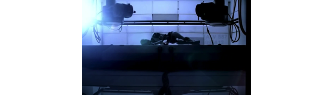

<!-- README.md is generated from README.Rmd. Please edit that file -->

# narampeg

<!-- badges: start -->


[](https://github.com/coolbutuseless/narampeg/actions/workflows/R-CMD-check.yaml)
<!-- badges: end -->

`narampeg` is a video decoder which supports mpeg1 video and mp2 audio.

Real-time video decoding + playback works (tested on a Mac M2).

This package uses [PL MPEG](https://github.com/phoboslab/pl_mpeg) mpeg
decoding (MIT licensed).

Note: Real-time audio playback is a work-in-progress. It does not appear
to be possible to have gap-less streaming playback using the current
`{audio}` package - but I’m happy to be proved wrong if you figure out
how to do it!!

## What’s in the box

- `ctx <- init_mpeg(file)`
- `mpeg_info(ctx)`
- `mpeg_decode_video(ctx)`, `mpeg_decode_audio(ctx)`
- `mpeg_seek(ctx, time_in_seconds)`
- `mpeg_rewind(ctx)` reset the mpeg stream
- Demo mpeg file:
  - A 5-second mpeg video snippet (with audio) from
    [BigBuckBunny](https://peach.blender.org/)
  - `system.file('bigbuckbunny.mpg', package = 'narampeg')`
  - BigBuckBunny is (c) copyright 2008, Blender Foundation /
    www.bigbuckbunny.org

## Future

- Figure out way to playback gap-less streaming audio. I don’t think
  this is possible with the current `{audio}` package.
- Implement a more complete video playback package using the `ffmpeg`
  library.
  - **Happy to help somebody else do this if they’re interested**

## Installation

You can install from
[GitHub](https://github.com/coolbutuseless/narampeg) with:

``` r
# install.packages('remotes')
remotes::install_github('coolbutuseless/narampeg')
```

## Example: Video playback at 25 fps

Video playback is achieved by decoding one-frame-at-a-time and rendering
to a fast graphics device.

The [`{governor}`](https://cran.r-project.org/package=governor) package
is used to limit the framerate to as close to 25fps as possible.

``` r
# install.packages('governor')
library(grid)
library(governor)
library(narampeg)

# Open a fast graphics device
x11(type = 'dbcairo', antialias = 'none', width = 7, height = 4)
dev.control(displaylist = 'inhibit')

# Initialise the playback
file <- system.file('bigbuckbunny.mpg', package = 'narampeg', mustWork = TRUE)
ctx <- narampeg::init_mpeg(file)
gov <- governor::gov_init(1/25)  # 25fps

# Loop: decode + render
while(TRUE) {
  nr <- mpeg_decode_video(ctx)
  if (is.null(nr)) break;
  dev.hold(); grid.raster(nr); dev.flush()
  gov_wait(gov)
}      
```


## Example: Rendering still images from a video

- Demo file (45 Mb)
  <https://phoboslab.org/files/bjork-all-is-full-of-love.mpg>

``` r
library(narampeg)

#~~~~~~~~~~~~~~~~~~~~~~~~~~~~~~~~~~~~~~~~~~~~~~~~~~~~~~~~~~~~~~~~~~~~~~~~~~~~
# Open a video file
#~~~~~~~~~~~~~~~~~~~~~~~~~~~~~~~~~~~~~~~~~~~~~~~~~~~~~~~~~~~~~~~~~~~~~~~~~~~~
file <- "~/projectsdata/mpeg/bjork-all-is-full-of-love.mpg"
ctx <- init_mpeg(file)
mpeg_info(ctx) |> unlist()
#>         width        height video_streams audio_streams           fps 
#>           960           540             1             1            25 
#>   sample_rate interval_time      duration 
#>         44100             0           248

#~~~~~~~~~~~~~~~~~~~~~~~~~~~~~~~~~~~~~~~~~~~~~~~~~~~~~~~~~~~~~~~~~~~~~~~~~~~~
# Render images from various times within the video
#~~~~~~~~~~~~~~~~~~~~~~~~~~~~~~~~~~~~~~~~~~~~~~~~~~~~~~~~~~~~~~~~~~~~~~~~~~~~
for (t in c(20, 30, 60)) {
  grid::grid.newpage()
  mpeg_seek(ctx, time = t)
  nr <- mpeg_decode_video(ctx)
  
  grid::grid.raster(nr)
}
```



## Example: Extract audio

- Audio data is delivered in `frames`.  
- One frame is 1152 interleaved stereo samples i.e. 2304 floating point
  values.
- Each sample is a value in the range \[-1, 1\]
- At a sampling rate of 44100 Hz, this is approximately 26 milliseconds
  of audio data

In this example 200 frames of audio (about 5 seconds) are extracted from
the mpeg file

``` r
library(narampeg)

#~~~~~~~~~~~~~~~~~~~~~~~~~~~~~~~~~~~~~~~~~~~~~~~~~~~~~~~~~~~~~~~~~~~~~~~~~~~~
# Open a video file
#~~~~~~~~~~~~~~~~~~~~~~~~~~~~~~~~~~~~~~~~~~~~~~~~~~~~~~~~~~~~~~~~~~~~~~~~~~~~
file <- system.file('bigbuckbunny.mpg', package = 'narampeg', mustWork = TRUE)
ctx <- init_mpeg(file, video = FALSE, audio = TRUE)
mpeg_info(ctx) |> unlist()
#>         width        height video_streams audio_streams           fps 
#>           640           360             1             1            24 
#>   sample_rate interval_time      duration 
#>         44100             0             4

#~~~~~~~~~~~~~~~~~~~~~~~~~~~~~~~~~~~~~~~~~~~~~~~~~~~~~~~~~~~~~~~~~~~~~~~~~~~~
# Extract 200 frames and format as an 'audioSample' object for playback
# with the `{audio}` package
#~~~~~~~~~~~~~~~~~~~~~~~~~~~~~~~~~~~~~~~~~~~~~~~~~~~~~~~~~~~~~~~~~~~~~~~~~~~~
snd <- mpeg_decode_audio(ctx, n = 200)
snd <- matrix(snd, nrow = 2)
snd <- audio::as.audioSample(snd, rate = 44100)

# plot first audio channel
plot(snd[1,], type = 'l') 
```


``` r
audio::play(snd)
```

## Preparing mpeg1 video files with `ffmpeg`

The included code for video decoding only supports the older `mpeg1`
video codec.

`ffmpeg` can be used to convert any video into this format.

    ffmpeg -i input.mp4 -c:v mpeg1video -q:v 0 -c:a mp2 -format mpeg output.mpg
